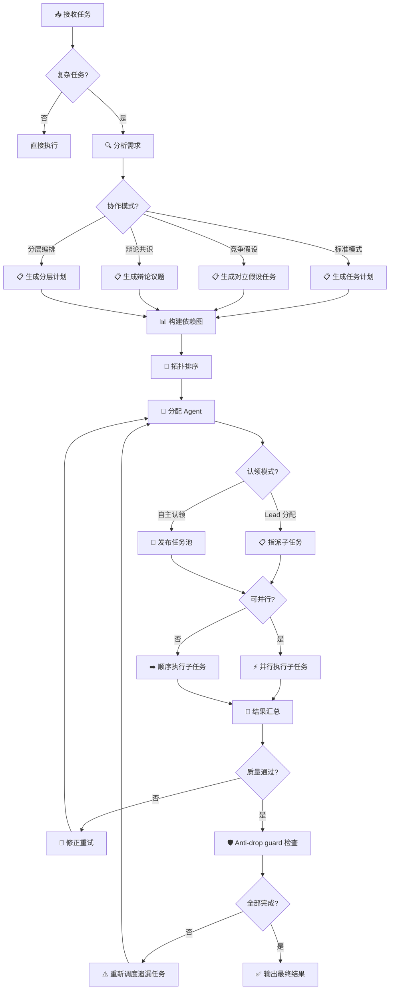

# Task Orchestrator

> 面向 OpenClaw 的复杂任务分解与多 Agent 编排引擎。 / Complex task decomposition and multi-agent orchestration engine for OpenClaw.

---

## 功能特性 / Features

- **智能任务分解** — 将复杂需求自动拆解为带依赖关系的子任务树 / Auto-decompose complex requests into dependency-aware subtask trees
- **多 Agent 协同编排** — 按任务类型自动路由到合适的 Agent，支持并行执行 / Route tasks to appropriate agents by type, with parallel execution support
- **依赖图与拓扑排序** — 自动解析子任务依赖，确定最优执行顺序 / Resolve subtask dependencies and determine optimal execution order
- **进度追踪与状态管理** — 实时追踪每个子任务的执行状态 / Real-time tracking of each subtask's execution status
- **结果汇总与质量门控** — 自动聚合子任务输出，支持审核与修正循环 / Aggregate subtask outputs with review and correction loops
- **可复用的任务模板** — 将常见工作流保存为模板，一键复用 / Save common workflows as reusable templates
- **高级协作模式** — 支持竞争假设（Adversarial Hypotheses）、辩论共识（Debate & Consensus）、分层编排（Hierarchical Orchestration）三种协作范式 / Advanced collaboration modes: Adversarial Hypotheses, Debate & Consensus, Hierarchical Orchestration
- **任务认领模式** — 支持 Lead 指派分配与 Agent 自主认领两种模式 / Task claiming: Lead-assigned dispatch vs self-service claiming
- **Handoff 结构化交接协议** — Agent 间任务交接采用标准化协议，确保上下文无损传递 / Structured handoff protocol for lossless context transfer between agents
- **交付证明机制** — 每个子任务完成时需提供可验证的交付物 / Delivery proof mechanism with verifiable artifacts per subtask
- **Anti-drop guard 防遗漏机制** — 自动检测遗漏子任务，确保零任务丢失 / Anti-drop guard to detect and prevent dropped subtasks
- **成本意识与优化策略** — 自动选择经济高效的执行路径，避免冗余调用 / Cost-aware optimization to minimize redundant invocations
- **能力分类与 Agent 映射体系** — 基于任务能力需求自动匹配最佳 Agent / Capability taxonomy with intelligent agent mapping

---

## 方案对比 / Comparison

| 维度 | Subagents (原生) | Agent Teams | **Task Orchestrator** |
|------|-------------------|-------------|------------------------|
| 任务分解 | 手动 | 半自动 | **自动依赖解析** |
| 并行执行 | 需手动管理 | 团队内协作 | **拓扑排序自动并行** |
| Agent 路由 | 手动指定 | 按角色分配 | **按任务类型智能匹配** |
| 进度追踪 | 无 | 基础 | **实时状态看板** |
| 复用性 | 低 | 中 | **任务模板系统** |
| 协作模式 | 单向委托 | 固定角色 | **竞争假设 / 辩论共识 / 分层编排** |
| 任务认领 | 无 | 团队内协商 | **Lead 分配 + 自主认领双模式** |
| 交接协议 | 自由文本 | 非正式 | **Handoff 结构化协议** |
| 质量保障 | 无 | 基础 | **交付证明 + Anti-drop guard** |
| 成本控制 | 无感知 | 无感知 | **成本意识自动优化** |
| 适用场景 | 单次简单委托 | 长期固定团队协作 | **复杂一次性/周期性项目** |

---

## 快速开始 / Quick Start

### 1. 安装

将本 skill 目录放置到 OpenClaw skills 路径下：

```
~/.openclaw/workspace/skills/task-orchestrator/
```

### 2. 创建任务计划

编写一个 YAML 格式的任务计划文件（详见下方格式示例）。

### 3. 触发编排

在对话中触发：

```
帮我执行任务计划 ./plans/my-project.yaml
```

Orchestrator 将自动解析依赖、分配 Agent、执行并汇总结果。

---

## 工作流程 / Workflow



---

## Advanced Patterns / 高级模式

Task Orchestrator 提供三种超越传统编排的高级协作模式，适用于高复杂度、高不确定性场景。

### 竞争假设 / Adversarial Hypotheses

为同一问题生成多个对立假设，分别由不同 Agent 独立验证，通过对比分析得出更可靠的结论。

> 示例：针对"迁移学习是否适用于当前小样本数据集"，同时让 scholar 提出支持论据、stock 从统计角度提出质疑，最后由 leader 裁决。

### 辩论共识 / Debate & Consensus

多 Agent 就某一议题进行结构化辩论，每轮提出论点与反驳，最终收敛到共识方案。

> 示例：在系统架构选型上，auto 倾向微服务而 scholar 倾向单体方案，经过两轮辩论后达成折中的模块化单体方案。

### 分层编排 / Hierarchical Orchestration

将大任务分解为多个层级，每个层级由不同的 Lead Agent 负责编排其下属子任务，形成树状指挥结构。

> 示例：leader 统筹一个论文项目，将"实验"子层交给 scholar 编排（包含数据准备、模型训练、结果分析），将"图表"子层交给 creator 编排。

---

## 任务计划文件格式 / Task Plan Format

```yaml
# plans/my-project.yaml
name: "示例项目"
description: "一个完整的任务编排示例"

tasks:
  - id: research
    name: "文献调研"
    agent: scholar
    description: "检索相关领域最新文献，总结关键技术方案"
    depends_on: []

  - id: design
    name: "方案设计"
    agent: scholar
    description: "基于调研结果设计技术方案"
    depends_on: [research]

  - id: implement
    name: "代码实现"
    agent: auto
    description: "根据设计方案完成核心模块开发"
    depends_on: [design]

  - id: test
    name: "测试验证"
    agent: auto
    description: "编写测试用例并验证功能正确性"
    depends_on: [implement]

  - id: review
    name: "成果汇总"
    agent: leader
    description: "汇总所有子任务结果，形成最终交付物"
    depends_on: [test]

output:
  format: markdown
  path: "./output/my-project-report.md"
```

---

## 配置要求 / Requirements

| 依赖 | 说明 |
|------|------|
| OpenClaw ≥ 1.0 | 核心运行时 |
| 可用 Agent 节点 | 至少 2 个具备不同角色的 Agent（通过 `sessions_send` 通信） |
| YAML 解析 | 任务计划文件使用 YAML 格式 |

### Agent 角色映射

任务计划中的 `agent` 字段需与 OpenClaw 中已注册的 Agent ID 对应：

| agent 值 | 对应助理 | 职责 |
|-----------|---------|------|
| `leader` | 总管 | 统筹协调、结果汇总 |
| `scholar` | 学术研究助理 | 文献调研、方案设计 |
| `auto` | 自动化助理 | 代码开发、脚本工具 |
| `stock` | 股票分析助理 | 行情分析、技术面 |
| `creator` | 内容创作助理 | 文案撰写、内容运营 |
| `mate` | 生活助理 | 日常记录、情绪支持 |
| `bian` | 加密货币助理 | 链上数据、交易策略 |

---

## License

[MIT](./LICENSE)
