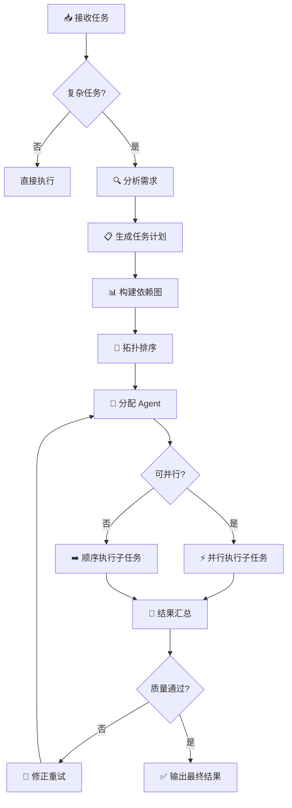

# Task Orchestrator

> 面向 OpenClaw 的复杂任务分解与多 Agent 编排引擎。 / Complex task decomposition and multi-agent orchestration engine for OpenClaw.

---

## 功能特性 / Features

- **智能任务分解** — 将复杂需求自动拆解为带依赖关系的子任务树 / Auto-decompose complex requests into dependency-aware subtask trees
- **多 Agent 协同编排** — 按任务类型自动路由到合适的 Agent，支持并行执行 / Route tasks to appropriate agents by type, with parallel execution support
- **依赖图与拓扑排序** — 自动解析子任务依赖，确定最优执行顺序 / Resolve subtask dependencies and determine optimal execution order
- **进度追踪与状态管理** — 实时追踪每个子任务的执行状态 / Real-time tracking of each subtask's execution status
- **结果汇总与质量门控** — 自动聚合子任务输出，支持审核与修正循环 / Aggregate subtask outputs with review and correction loops
- **可复用的任务模板** — 将常见工作流保存为模板，一键复用 / Save common workflows as reusable templates

---

## 方案对比 / Comparison

| 维度 | Subagents (原生) | Agent Teams | **Task Orchestrator** |
|------|-------------------|-------------|------------------------|
| 任务分解 | 手动 | 半自动 | **自动依赖解析** |
| 并行执行 | 需手动管理 | 团队内协作 | **拓扑排序自动并行** |
| Agent 路由 | 手动指定 | 按角色分配 | **按任务类型智能匹配** |
| 进度追踪 | 无 | 基础 | **实时状态看板** |
| 复用性 | 低 | 中 | **任务模板系统** |
| 适用场景 | 单次简单委托 | 长期固定团队协作 | **复杂一次性/周期性项目** |

---

## 快速开始 / Quick Start

### 1. 安装

将本 skill 目录放置到 OpenClaw skills 路径下：

```
~/.openclaw/workspace-leader/skills/task-orchestrator/
```

### 2. 创建任务计划

编写一个 YAML 格式的任务计划文件（详见下方格式示例）。

### 3. 触发编排

在对话中触发：

```
帮我执行任务计划 ./plans/my-project.yaml
```

Orchestrator 将自动解析依赖、分配 Agent、执行并汇总结果。

---

## 工作流程 / Workflow



---

## 任务计划文件格式 / Task Plan Format

```yaml
# plans/my-project.yaml
name: "示例项目"
description: "一个完整的任务编排示例"

tasks:
  - id: research
    name: "文献调研"
    agent: scholar
    description: "检索相关领域最新文献，总结关键技术方案"
    depends_on: []

  - id: design
    name: "方案设计"
    agent: scholar
    description: "基于调研结果设计技术方案"
    depends_on: [research]

  - id: implement
    name: "代码实现"
    agent: auto
    description: "根据设计方案完成核心模块开发"
    depends_on: [design]

  - id: test
    name: "测试验证"
    agent: auto
    description: "编写测试用例并验证功能正确性"
    depends_on: [implement]

  - id: review
    name: "成果汇总"
    agent: leader
    description: "汇总所有子任务结果，形成最终交付物"
    depends_on: [test]

output:
  format: markdown
  path: "./output/my-project-report.md"
```

---

## 配置要求 / Requirements

| 依赖 | 说明 |
|------|------|
| OpenClaw ≥ 1.0 | 核心运行时 |
| 可用 Agent 节点 | 至少 2 个具备不同角色的 Agent（通过 `sessions_send` 通信） |
| YAML 解析 | 任务计划文件使用 YAML 格式 |

### Agent 角色映射

任务计划中的 `agent` 字段需与 OpenClaw 中已注册的 Agent ID 对应：

| agent 值 | 对应助理 | 职责 |
|-----------|---------|------|
| `leader` | 总管 | 统筹协调、结果汇总 |
| `scholar` | 学术研究助理 | 文献调研、方案设计 |
| `auto` | 自动化助理 | 代码开发、脚本工具 |
| `stock` | 股票分析助理 | 行情分析、技术面 |
| `creator` | 内容创作助理 | 文案撰写、内容运营 |
| `mate` | 生活助理 | 日常记录、情绪支持 |
| `bian` | 加密货币助理 | 链上数据、交易策略 |

---

## License

[MIT](./LICENSE)
